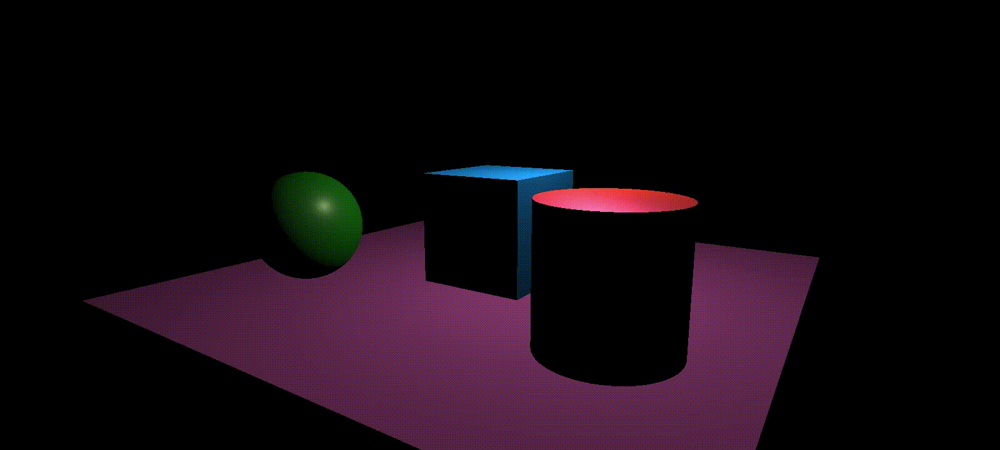

<!-- markdownlint-disable MD033 MD041 -->
<div align="center">
  <!-- <a href="https://github.com/othneildrew/Best-README-Template">
    
  </a> -->

  <h2 align="center">dalpeng</h2>
  <p align="center">
    Web Game Engine with simple composable scripting API
  </p>
</div>

## About dalpeng



### Supporting Features

Now on development, supporting below features:

- Basic 3D objects
- Directional and point lights
- PBR Material, with basic properties(base color, metallic, roughness, emissive)
- Composable scripting API, inspired by modern web frameworks(React, Vue...)
- Scene-level entity utilities (tag queries, proximity lookups)

## Requirements

- Node.js 18.18 or newer (the repo currently targets Node 24.x)
- [pnpm](https://pnpm.io) 10.x managed through Corepack (`corepack enable && corepack prepare pnpm@10.21.0 --activate`)

## Getting Started

The latest version of `node` and `npm` should be installed in your environment.

Install the packages

```sh
npm i dalpeng
```

Or install the core part without a scripting API

```sh
npm i @dalpeng/core
```

### Usage

You can define App, Scene, and GameEntity with function form.

```typescript
defineGameEntity(() => {
  withName("Box");

  const transform = useComponent(Transform);
  transform.position = vec3(0, 0, 0);

  const renderer = useBox();
  renderer.material.baseColor = vec3(0, 1, 1);
  renderer.material.metallic = 0.2;
  renderer.material.roughness = 0.4;
});
```

You can group or preconfigure components with composable scripting API.

```typescript
const useBox = () => {
  const renderer = useComponent(MeshRenderer);
  renderer.mesh = MeshBuilder.box();
  return renderer;
};
```

Check out demo for details.

#### Scene utilities

Scenes expose helper APIs for entity lookup:

```ts
const enemies = scene.findByTag("enemy");
const nearby = scene.queryRadius(vec3(0, 0, 0), 5);
```

Child entities inherit their parent's scene/tag state automatically, so tagging an entity or reparenting it keeps these queries accurate.

## How to run demo

The latest version of `node` and `pnpm` should be installed in your environment.

1. Clone this repository.

   ```sh
   git clone https://github.com/threedalpeng/dalpeng
   ```

2. Install the packages

   ```sh
   pnpm i
   ```

3. Prebuild internal packages using turbo

   ```js
   pnpm turbo build
   ```

4. Run the demo you want

   ```js
   cd demo/basic-3d-objects
   pnpm run dev
   ```

### Live development workflow

To run a demo and automatically rebuild dependent packages on code changes:

```sh
pnpm run dev:basic
```

This command launches the `basic-3d-objects` demo alongside watch builds for its package dependencies, so editing `packages/*` triggers rebuilds and hot reloads in the demo.


## About subpackages

- dalpeng: Scripting API wrapper of @dalpeng/core.
- @dalpeng/core: Core part of this game engine.
- @dalpeng/math: Supporting math for 3D Graphics, including Vector, Matrix and Quaternion.

## License

## Acknowledgement

I learned computer graphics and was inspired by many amazing materials:

- Books
  - [Game Programming Patterns](https://gameprogrammingpatterns.com/) by Robert Nystrom
  - Game Engine Architecture by Jason Gregory
- Web materials
  - [WebGL2 Fundamentals](https://webgl2fundamentals.org/)
  - [Learn OpenGL](https://learnopengl.com/)
  - [GLTF 2.0](https://github.com/KhronosGroup/glTF/blob/main/specification/2.0/README.md)
  - [Google Filament Materials Guide](https://google.github.io/filament/Materials.html)

and several more...

I presented to other students what I learned and experienced through this project. Check out [here(Only in Korean/한국어)](https://threedalpeng.github.io/presentations) and click the '게임엔진을 만들어보자!' tab if you're interested.
